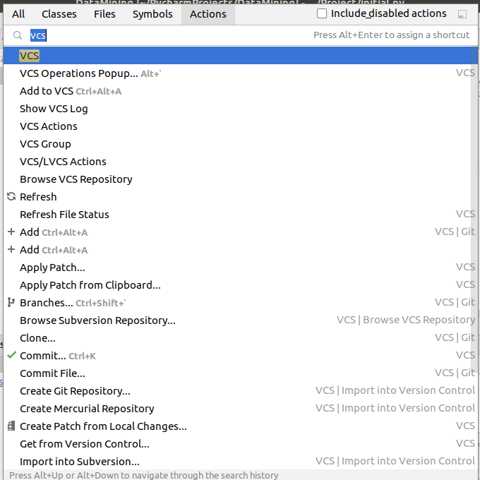
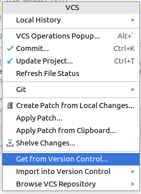
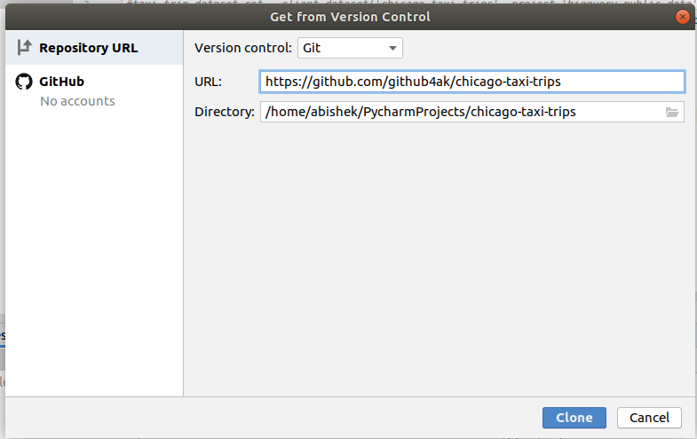
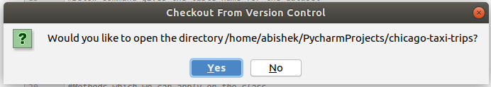

# chicago-taxi-trips
CS 6140: Data Mining Project - Chicago Taxi Trips by Shaurya Sahai, Abishek Krishnan and Sushmitha Sunkurdi Nataraj

Dataset: https://www.kaggle.com/chicago/chicago-taxi-trips-bq

**Setup with PyCharm**

Using PyCharm, 
1. Ctrl + Shift + A - type **VCS** into the searchbox, open VCS window

2. Select **Get From Version Control...** from the options

3. Give the URL: **https://github.com/github4ak/chicago-taxi-trips** 

4. Checkout from Version Control -  **Yes**

This should setup the project in PyCharm.

**Using Git**

Using Git to add and files and make changes [I use the terminal instead of the PyCharm plugin]

$ git pull

$ git checkout -b [name_of_your_new_branch]

 -- Make your file changes
 
$ git diff

$ git add [required_files]

$ git push orign [name_of_your_new_branch]

These should create your git changes in the repository, and create a Merge request by following https://developers.sap.com/tutorials/webide-github-merge-pull-request.html

You can track your local to the master branch, 

$ git branch --set-upstream-to=origin/master [name_of_your_local_branch]

$ git pull

**Using google.cloud**

From  the terminal,

pip install google-cloud-bigquery

**To-do: Need to delete the credentials folder when this is made public**

On authentication error, navigate to https://cloud.google.com/docs/authentication/getting-started and follow the instructions.
